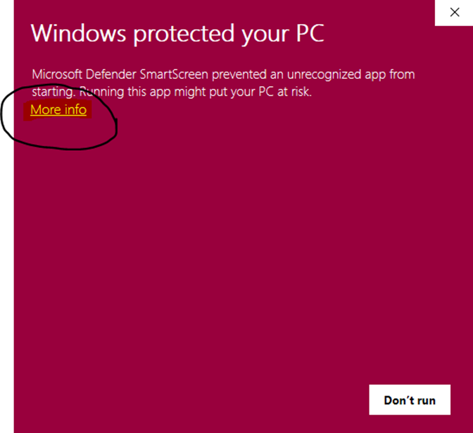
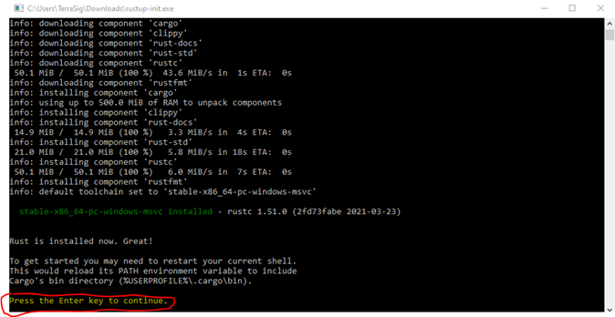
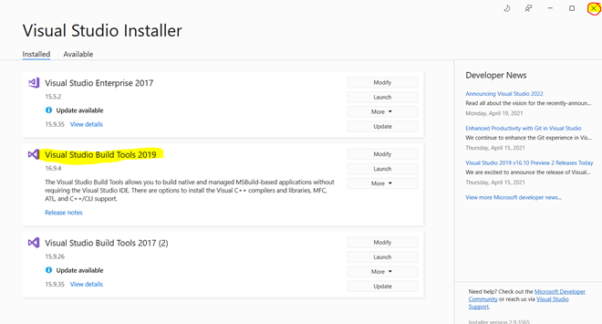
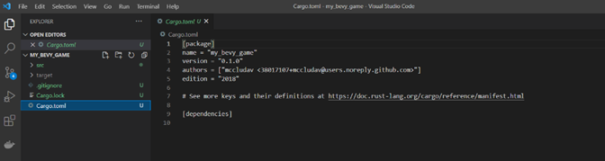

# Screenshot Installation of Bevy with Rust on Windows 10
Visual Guide for Installing Bevy with Rust on a Windows 10 Machine

### Installing Rust
1.	Navigate to https://github.com/bevyengine/bevy.

2.	Scroll down to Docs and click on The Bevy Book.

3.	Click on Setup.
	

4.	Click on Rust Getting Started Guide.

5.	Click on DOWNLOAD RUSTUP-INIT.EXE (64-BIT).

6.	Click on the up arrow 

7.	and select Open.

8.	If this window pops-up, select More info.

9.	Select Run anyway.

10.	Type 1 [Enter] for default installation.

11.	Press [Enter] to continue.

### Installing VS2019 Build Tools
12.	Back at https://bevyengine.org/learn/book/getting-started/setup/ select VS2019 build tools

13.	Press the down arrow shown,

14.	and select Open.

15.	Select Yes to install

16.	Press Continue.

17.	Select Install.

18.	When complete, close the window.

### Run a Rust Program
19.	Type Command Prompt in search field of task bar.

20.	Click on Command Prompt App.

21.	In the Command Prompt window, type cd c:\

22.	Next type mkdir Rust [Enter], followed by cd Rust [Enter].

23.	Type cargo new my_bevy_game [Enter], followed by cd my_bevy_game [Enter].

24.	Type cargo run.

### Add Bevy to Project’s Cargo.toml
25.	Type Visual Studio Code in the search window and select the App.

26.	Select File drop down menu and Open Folder.

27.	Navigate to my_bevy_game sub-directory and click on Select Folder.
	

28.	Open Cargo.toml file and add in [dependencies]

29.	Add below [dependencies], line 10, bevy = “0.5” # verify version at https://crates.io/crates/bevy.  Ensure at the shown website that 0.5 is the latest release, if not, then set bevy to the release number.  Type a Ctrl-S to save file Cargo.toml.

30.	Again, in the Command Prompt window type cargo run [Enter].  It will take a while to download and compile the dependencies.

31.	For more information and further steps refer to https://bevyengine.org/learn/book/getting-started/setup/.

